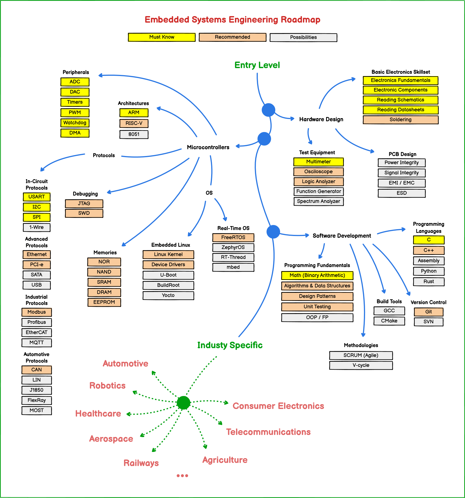

# Embedded Engineering Roadmap

This is a roadmap for individuals aspiring to build a career as an Embedded Developer or Embedded Engineer.
In order to assist beginners, steps have been taken to create a roadmap that is straightforward and easy to comprehend.

If you think that this map can be improved in anyway, please start an issue or pull request, I’ll be maintaining and updating this repository yearly, the source file can be edited using [Balsamiq Mockups](https://balsamiq.com/download/) 

**A special thanks to my friends in the Iranian Twitter community (Electronics and Embedded Systems Engineers) for their help in updating this roadmap.**

---

